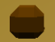

# CyberSauras Dash

Author: Rakshit Tikoo

Design: The game is an endless runner inspired by the google chrome no-internet game, where you control a cybernetic dinosaur. Your objective is to eat or avoid cybernetic enemies. You are always burning fuel, hence you need to eat a certain type of enemy to replenish it. You also have the option of using a laser beam to kill enemies in front of you, but each shot also consumes the fuel. 

Screen Shot:

How To Play:  

There are following characters in the game - 

The Player - 

Eatable Enemy - 

Shooter Enemy - 

Hard Obstable - 

Your goal is to score as many points as possible. The score is seen at the bottom left of the screen. You must make sure you have sufficient fuel always, as it continuously burns as you keep on running. It is seen at the bottom right of the screen. If you hit an obstacle or shooter enemy you lose. If you run out of fuel you lose. The shooter enemy also continously shoots lasers, and you lose if you hit them. 
To replenish your fuel you can eat the eatable enemy, by simply running into them. You also have a laser which you can shoot on all enemies (shooter, obstacle, eatable) to kill them, but it also costs fuel. The game becomes faster after every 200 points scored. How high can you score?

Controls: 

W A S D - Player movement

SpaceBar - Player laser 

This game was built with [NEST](NEST.md).
